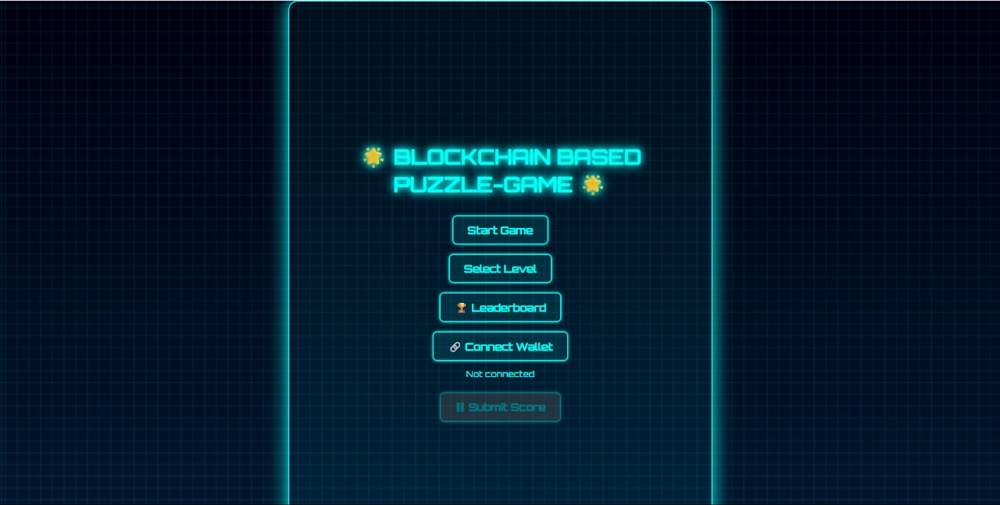
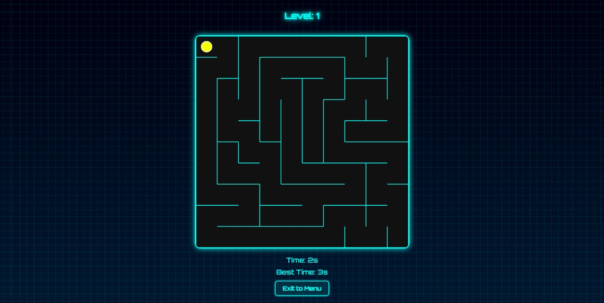

## ON-CHAIN PUZZLE GAME WITH LEADERBOARD

## Description:

A futuristic Web3 puzzle game where players solve randomly generated mazes and submit their scores to a private Ethereum blockchain using MetaMask and Ganache. The game features a connected leaderboard, wallet authentication, and score tracking stored immutably on-chain.

## 🚀 Tech Stack:

- 🕸️ Frontend: HTML, CSS, JavaScript
- 🔗 Blockchain: Ethereum (Ganache - Private Blockchain)
- 💼 Wallet: MetaMask
- 📦 Smart Contracts: Solidity (Deployed via Hardhat)
- 📚 Web3 Library: ethers.js

## 🎮 Features:

- 🔐 MetaMask wallet connection
- 🧩 Random maze generation per level
- 🕒 Timer & Best Score tracking
- 📝 Submit scores to the blockchain
- 📊 Leaderboard (stored on-chain)
- 🔄 Supports multiple wallet accounts

## SET-UP INSTRUCTIONS:
### 1. Clone the repository

git clone https://github.com/your-MOHAMEDAAKIFASRAR/blockmaze.git
cd blockmaze
2. Start Ganache (Private Blockchain)
Open Ganache GUI or run: ganache --chain.chainId 1337

3. Deploy Smart Contract
bash
Copy
Edit
npx hardhat compile
npx hardhat run scripts/deploy.js --network localhost
4. Run Frontend
Just open frontend/public/game/game.html in your browser (served via Live Server or directly).

Make sure MetaMask is connected to http://127.0.0.1:7545 with chain ID 1337.

### Screenshots (Demo):

## 🔐 How Blockchain is Used:

- Players connect via MetaMask.
- After finishing the puzzle, they submit their score.
- The score is sent as a transaction to the smart contract.
- The smart contract stores the score on the Ganache blockchain.
- All leaderboard data is retrieved from the smart contract.

## 🚀 Future Updates:

- Deploy on Polygon or Sepolia Testnet
- Token rewards for top performers
- Multiplayer PvP mode
- NFT-based level unlocks

## ❗ Challenges Faced:

- Smart contract design for storing per-level scores
- Handling MetaMask wallet switching and re-connecting
- Ganache reverts and missing ABI issues
- Making a responsive and animated Web3 UI

## 🧠 Made for [BlockDag Hackathon 2025]
This project was built during [BlockDag Hackathon] !!

## Team: [Blockquist Builders]